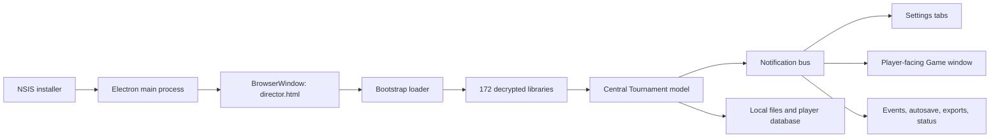

# Technical architecture

## Stack and packaging

| Layer | Finding |
|---|---|
| Installer | 32-bit NSIS bootstrap containing a 64-bit Windows application |
| Desktop runtime | Electron 5.0.10, Chromium 73.0.3683.121 |
| UI | Handwritten HTML/CSS and JavaScript DOM generation; no React/Vue/Angular runtime |
| Code style | Global modules, constructor functions, prototypes, custom inheritance, inline handlers |
| Dependencies | `electron-updater`, `aes-js`, `jszip`, `iconv-lite`, `chardet`, `uuid`, `node-machine-id`, and small utilities |
| Update channel | Generic electron-updater feed at `https://www.thetournamentdirector.net/autoupdatev3` |

Version 3.7 is a port of the earlier Internet Explorer/Windows Media Player-based application into Electron. Much of the earlier browser-oriented design remains visible in the code.

## Startup and runtime

1. `director.js` creates the main `BrowserWindow`, enables Node integration and webviews, and loads local `director.html`.
2. `tdBootstrap.js` loads a fixed sequence of library modules.
3. In a packaged build, each protected library is hex-encoded AES-CTR ciphertext. The loader derives its 32-byte key from a plaintext main-process module, decrypts each library to a temporary file, loads it as a script, then removes it.
4. `tdPostBoot.js` initialises configuration, updater, language catalogues, data store, preferences, database, windows, prize configuration, tournament, layout renderer, clock, licensing, and last-session state.

The obfuscation prevents casual reading but is not a security boundary because both the decryption routine and key material ship with the app.

## Main components

- `tdTournament.js`: aggregate root, time/state calculations, totals, scoring inputs, tournament lifecycle.
- `tdObjs.js` and `tdNewObjs.js`: domain model for levels, finance, players, transactions, prizes, tables, layouts, events, rules, and history.
- `tdStatus.js`: clock loop, countdown, level changes, start/end/restart, hand timers.
- `tdNotif.js` and `tdNotifications.js`: synchronous in-process publish/subscribe event bus.
- `tdGameWindow.js`: public pages, screen rotation, full-screen display, overlays, and player controls.
- `tdSettingsDialog.js` plus `*Page.js`: operator UI.
- `tdTables.js`: seat suggestions, balancing, consolidation, movement history, undo/redo.
- `tdLayoutLoader.js`, `tdLayoutTokenImpl.js`, `tdNewObjs.js`: layout object graph, conditional property sets, token rendering, HTML/CSS generation.
- `tdDB.js`: leagues, seasons, player names, contact records, images, and local persistence.
- `tdEvents.js`: trigger/condition/action automation.
- `tdMain.js` and template modules: save/load, exports, summaries, printing, and shared utilities.
- `tdServer.js`, `tdComm.js`, partner modules, and `tdUpdater.js`: licensing/news/update and third-party communications.

## Data model

`Tournament` owns or references:

- identity, title, league/season, notes, start/end timestamps
- `FinancialConfig`: buy-in/rebuy/add-on profiles, rakes, bounties, points, guarantee, contribution
- `GamePlayers`: players, transactions, eliminations, rankings, hits, chops
- `GameLevels`: rounds and breaks
- `GamePrizes`: configured/calculated awards
- `GameTables`: tables, seats, locks, dealer buttons, movement state
- `LO.Layout`: screen sets, screens, rows/columns/cells, property sets, banners, tokens
- `GameEvents`: triggers, conditions, sounds, overlay messages, actions
- chips, rules, history, countdown, and current clock state

## Persistence

The default user data root is `Documents/The Tournament Director 2`; Electron's `userData` directory holds application configuration when packaged. A configurable Data Store contains saves, templates, images, sounds, receipts, and the database.

| Extension/file | Content |
|---|---|
| `.tdt` | Complete tournament, optionally with embedded layout |
| `.tlo` | Display layout |
| `.trt` | Levels/rounds template |
| `.tpt` | Prize template |
| `.ttb` | Table template |
| `.tst` | Event/sound template |
| `.tch` | Chip template |
| `.trl` | Rules template |
| `td.db` | Player names, leagues, seasons, defaults |
| per-player files | Contact details and player metadata |
| `prefs.sav` / `repo.sav` | Preferences and Data Store selection |

These are plaintext constructor expressions such as `{ V: "3.0", T: new Tournament(...) }`. Loaders call `safeEval`, which ultimately uses JavaScript `eval`. This enables backward-compatible reconstruction of typed objects but makes imported files executable rather than passive data.

## Integrations and network behaviour

- Automatic update check/download via the vendor HTTPS update feed.
- Vendor endpoints for news/version checks, evaluation, license validation/deactivation, patches, and optional error reports.
- Direct StatsGenie SOAP integration over HTTPS.
- Direct legacy Hendon Mob and RankingHero submission endpoints embedded as HTTP URLs.
- File exports for several poker league/statistics services.
- Optional user-defined status publishing to a local file or URL.

Player data is stored locally in plaintext. Some optional exports and status updates can include player information, so privacy depends on operator configuration and destination security.

## Security observations

These are architectural findings, not proof of active exploitation:

1. **High — imported files are executable.** Tournament and template loaders use `eval`; a malicious file can execute JavaScript.
2. **High — renderer is privileged.** `nodeIntegration: true`, no context isolation, and no renderer sandbox mean injected JavaScript can access Node and the filesystem.
3. **High — obsolete runtime.** Electron 5/Chromium 73 is long outside Electron's supported release window.
4. **Medium — no Content Security Policy.** The main HTML contains inline scripts/handlers and no CSP.
5. **Medium — legacy plaintext partner endpoints.** Some optional direct integrations use HTTP, allowing interception or modification in transit.
6. **Medium — privileged event action.** Configured events can launch local programs; this is intentional but must never be populated from untrusted templates.
7. **Low — source obfuscation is reversible.** It should not be relied upon to protect secrets or trust decisions.

Operationally, do not open untrusted `.tdt` or template files, and do not use legacy HTTP integrations for sensitive data.

## Limits of this pass

- The Windows executable was not run, so runtime traffic and exact filesystem writes were not captured dynamically.
- The original build repository, development dependencies, tests, and commit history are not in the release bundle.
- External partner compatibility was inferred from shipped code; those services were not contacted.
- Authenticode certificate metadata was inspected, but full platform trust validation should also be performed on Windows.
